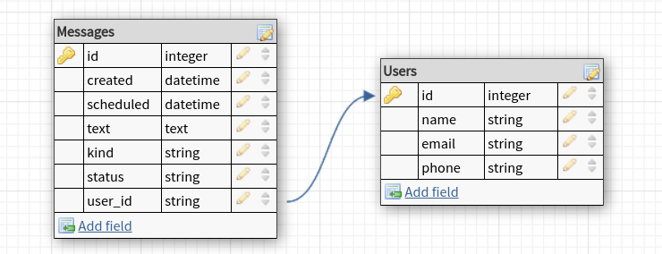

[](https://circleci.com/gh/mrsbelo/message_scheduler/tree/master)

# Agendador de Mensagens

## Projeto - Plataforma de comunicação


Objetivo: criar um serviço de agendamento de mensagens. Inicialmente o serviço irá permitir agendar mensagens de email, sms, push e whatsapp.

---

### Como utilizar

O projeto foi produzido em ambiente linux(ubuntu 20.04), seguem abaixo os requisitos de sistema:

 - [Docker - 19.03.8](https://www.docker.com/)
 - [Docker-Compose - 1.25.0](https://docs.docker.com/compose/)
 - [Python - 3.8](https://www.python.org/)

Para começar a utiliza-ló basta rodar o comando:

```shell
$ make docker_build_n_run
```
Esse make irá executar o build do projeto e também vai iniciar o mesmo, que ficará escutando no endereço http://localhost:5000

Endpoints disponíveis:

- http://localhost:5000/healthcheck
    - [GET] Verificar se o servidor está funcionando

- http://localhost:5000/messages
    - [GET] Listagem de todas as mensagens agendadas
    - [POST] Criação de um novo agendamento de mensagem

- http://localhost:5000/messages/{message_id}
    - [GET] Detalhes de uma mensagem agendada
    - [DELETE] Remoção de um agendamento de mensagem

- http://localhost:5000/users
    - [GET] Listagem de todos os usuários cadastrados
    - [POST] Criação de um novo usuário

- http://localhost:5000/users/{user_id}
    - [GET] Detalhes de um usuário
    - [PUT] Atualização do cadastro de um usuário
    - [DELETE] Remoção de um usuário

---

### Database Schema


**User** 
- **name**: nome do usuário
- **email**: para as mensagens dos tipos email e push
- **phone**: para as mensagens dos tipos sms e whatsapp

**Message** 
- **created**: gerado automaticamente, registra o momento da criação do agendamento
- **scheduled**: data e horário do agendamento para que a mensagem seja enviada
- **text**: a mensagem a ser enviada ao user
- **kind**: plataforma de envio da mensagem: 1 para email, 2 para sms, 3 para push e 4 para whatsapp
- **status**: registra se o envio já foi efetuado: 1 para agendada e 2 para enviada
- **user_id**: chave estrangeira do alvo da mensagem



## Bibliotecas do python

Um pouco sobre as bibliotecas python que eu utilizei:

- [Black](https://black.readthedocs.io/en/stable/) - auto formatação de código, de fácil [configuração](https://medium.com/@marcobelo/setting-up-python-black-on-visual-studio-code-5318eba4cd00)
- [Marshmallow](https://marshmallow.readthedocs.io/en/stable/) - é o melhor validador que eu conheço, permiti inclusive a criação de validadores dinamicamente (está na minha lista de próximos posts no medium falar sobre isso)
- [Flask](https://flask.palletsprojects.com/en/1.1.x/) - é um framework web bem simples de se trabalhar, apesar de eu não utilizá-lo no dia-a-dia fui capaz de realizar esse projeto e aprender ele ao mesmo tempo
- [ipdb](https://pypi.org/project/ipdb/) - se tem uma coisa que eu amo no python é o ipdb, em qualquer lugar do código basta colocar ele lá e pronto você para o tempo e debuga a vontade com todas as variáveis com seus devidos valores daquele momento


## Ferramentas utilizadas

- [DB Designer](https://www.dbdesigner.net/) - design do database schema
- [Stoplight](https://stoplight.io/) - interface para a criação da documentação OpenApi3
- [CircleCI](https://circleci.com/) - ferramenta para rodar testes e fazer builds online
- [Insomnia Core](https://insomnia.rest/) - excelente ferramenta para testar APIs


## Documentação do código

Esse projeto possui uma pasta **/docs** localizada na raiz, nela você irá encontrar dois arquivos de documentação:

- [OpenApi3](https://github.com/mrsbelo/message_scheduler/blob/master/docs/Scheduler_API.v1.yaml) - yaml do projeto em OpenApi3 escrito com a ferramenta Stoplight mencionada acima
- [Insomnia Workspace](https://github.com/mrsbelo/message_scheduler/blob/master/docs/message_scheduler_Insomnia_2020-08-02.json) - json do workspace do Insomnia que eu utilizei durante a produção desse projeto

